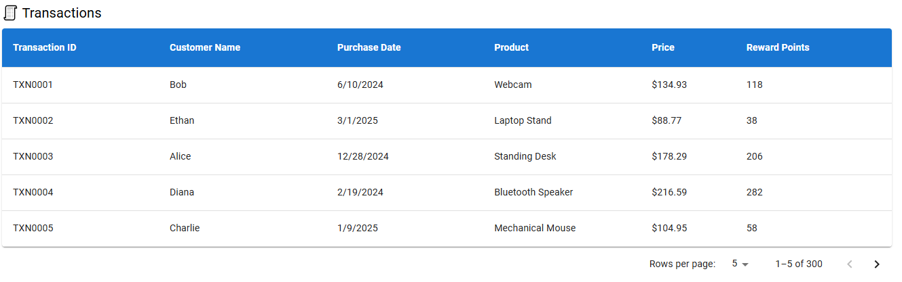
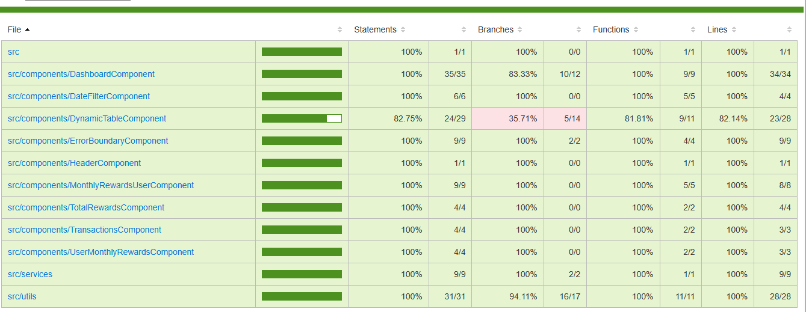

# Rewards-app

This Web app shows dashboard about customers purchase and award points accumulated based on recorded purchase. We are showing three tables to show different details like 'points accumulated by different customers in 3 months purchase', 'total points accumulated by each customer' and 'transaction details of all purchase'

# Technologies used
React.js19, Javascript, Html5, Css3. For unit testing used jest and for linting and formatting used eslint and prettier.

## Available Scripts

In the project directory, you can run:

### `npm start`

Runs the app in the development mode.\
Open [http://localhost:3000](http://localhost:3000) to view it in your browser.

The page will reload when you make changes.\
You may also see any lint errors in the console.

### `npm test`
Launches the test runner in the interactive watch mode.\

### `npm run lint`
To check linting issues in app.\

### `npm run build`
Builds the app for production to the `build` folder.\
It correctly bundles React in production mode and optimizes the build for the best performance.

The build is minified and the filenames include the hashes.\
Your app is ready to be deployed!

### `Screen for data filter by date range`

### `Table for Users monthly rewards`

### `Table for Users monthly total rewards`

### `Screen for total rewards accumulated by different customers`

### `Screen for transaction records of customers`

### `Screen on data loading failed`

### `Unit test coverage report`

## Github link to access repository

Open [https://github.com/sumitkumar14/react-reward-app](https://github.com/sumitkumar14/react-reward-app)

